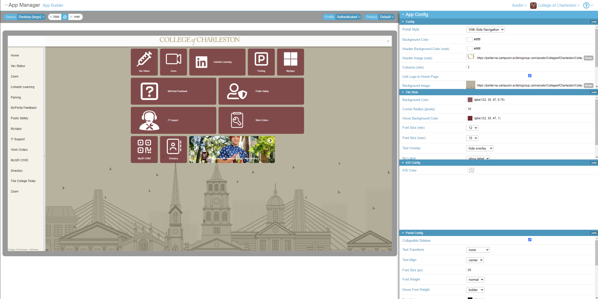
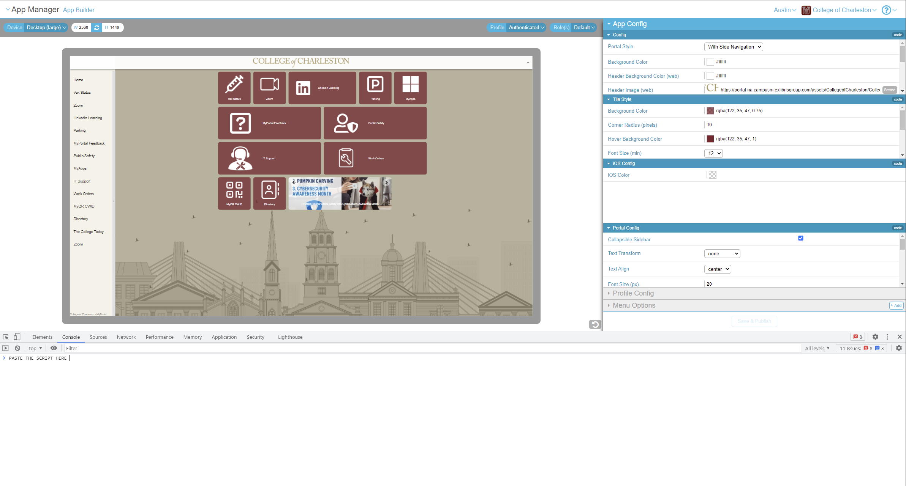

# CampusM (Ex Libris) Tile Role Mapper

This is a simple project that allows one to easily build a JSON map of the tiles and their associated roles in the [CampusM App Builder](https://appmanager-na.campusm.exlibrisgroup.com/app-builder#) (inside App Manager). It also pulls in the metadata tag for each tile, whose value is used to indicate whether the tile is available on mobile, desktop, or both. If it's both, the tag contains both `mobile` and `desktop`.

## How to Use It

1. Copy the Javascript from [role-mapper.js](role-mapper.js).
2. Open the [CampusM App Builder](https://appmanager-na.campusm.exlibrisgroup.com/app-builder#)
   
3. Open the dev tools in your browser.
4. Open the Console tab in your dev tools.
5. Paste the copied JS into the console.
   
6. Run it.
7. When it finishes executing, copy the created map to your clipboard with

```
copy(roles_map);
```

8. Paste the copied JSON object into a JSON file in this project, or wherever you want the map to be stored.
9. Sample output from the script is stored in [roles_map.json](roles_map.json).
10. You can then also convert this data into CSV format with the following:

```
python json-to-csv.py --json-file <json file, e.g. roles_map.json>
```

This will output the data in CSV format to a CSV file with the same name as the JSON file, except with a `.csv` extension instead of `.json`.
